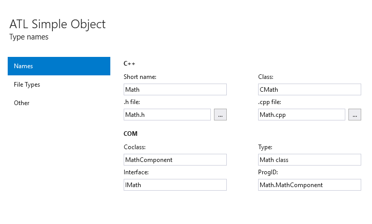
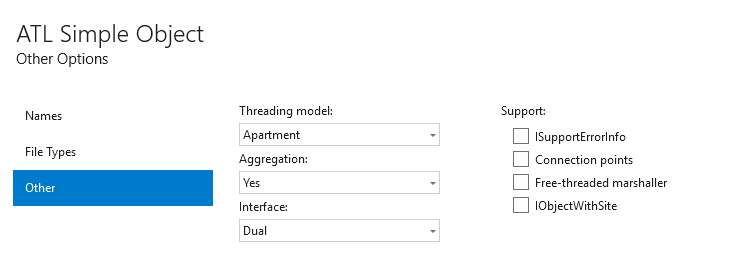
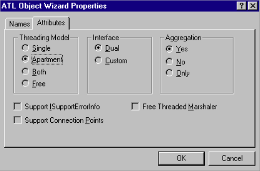
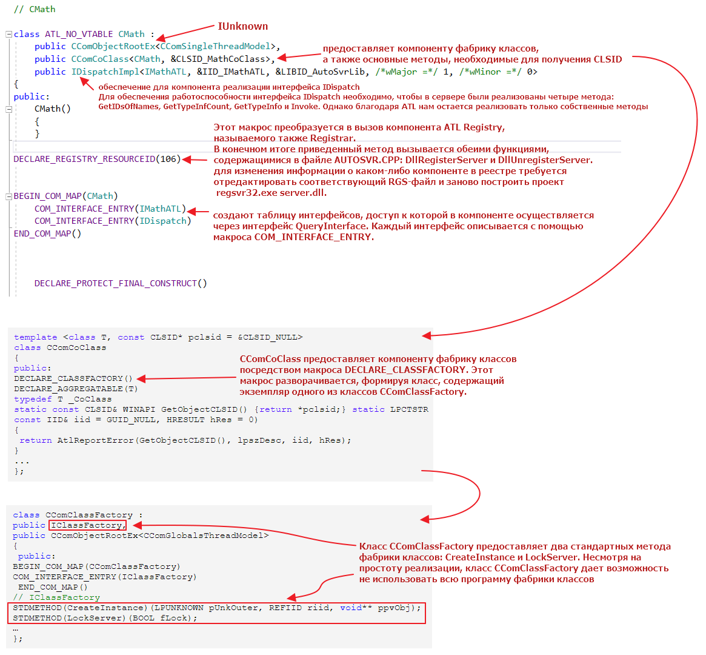
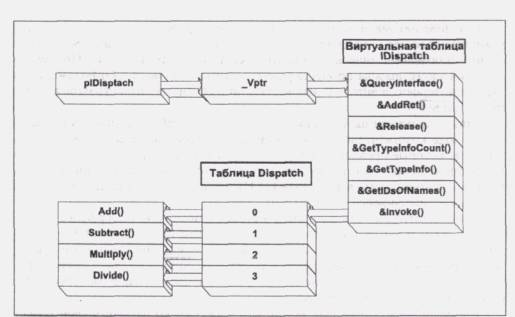
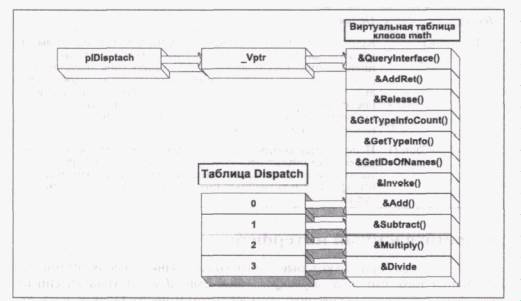

## Реализация проекта СОМ-сервера на ATL

### Names

|     Поле      | Описание                                                     |
| :-----------: | :----------------------------------------------------------- |
|  Short Name   | Данный элемент обеспечивает введение префикса для остальных элементов диалогового окна. Он непосредственно не связан ни с каким определенным атрибутом объекта. При изменении этого значения элементы оставшейся части страницы также изменятся. |
|     Class     | Имя С++-класса, реализующего объект.                         |
| Файлы Н и СРР | Файлы заголовков и файлы реализации.                         |
|    CoClass    | Имя СОМ-класса, которое будет использовано внешними клиентами в качестве "типа" компонента. |
|   Interface   | Имя интерфейса, который требуется создать для объекта. Рассматриваемый нами объект будет предоставлять интерфейс IMath, который мы уже описали в этой главе. |
|     Type      | Удобное для восприятия имя компонента, размещаемое в реестре. При программировании значения не имеет. |
|    ProgID     | Программный идентификатор компонента. Клиенты могут его использовать для размещения и создания экземпляра компонента. |

### Other options

|           Поле            | Описание                                                     |
| :-----------------------: | :----------------------------------------------------------- |
|      Threading Model      | СОМ-компоненты могут использовать следующие потоковые модели: *Простую* — компонент использует только один поток. *Модель изолированных потоков* — объекты расположены только внутри собственных потоков. *Двойную* — компонент может поддерживать как изолированные потоки, так и работу с произвольным количеством потоков. *Свободную* — компонент поддерживает работу с произвольным количеством потоков. |
|         Interface         | Мы еще не рассматривали понятие двунаправленного интерфейса. Отметим, однако, что в соответствии с рекомендациями Microsoft компоненты по возможности должны его поддерживать. Двунаправленный интерфейс реализует как пользовательский, так и стандартный интерфейс автоматизации IDispatch. Это дает возможность клиенту выбирать способ доступа к функциям компонента. |
|        Aggregation        | Агрегация представляет собой широко используемый в СОМ технический прием, позволяющий включать и использовать в компоненте функции другого компонента. Внутренний компонент должен явно поддерживать эту технологию с помощью своей реализации интерфейса IUnknown. Значение данного атрибута позволяет компоненту выбирать, поддерживать агрегацию или нет. |
| Support ISupportErrorInfo | При установке данного атрибута мастер объекта добавит в проект реализацию интерфейса ISupportErrorInfo. Таким образом, будет обеспечен устойчивый механизм передачи сообщений об ошибках в системе клиент-сервер. |
| Support Connection Points | При установке данного атрибута мастер объектов добавит в проект точку подключения интерфейсов СОМ. Эта процедура будет подробно рассмотрена позже. |
|  Free-Threaded Marshaler  | В проект добавляются средства транспортировки указателей интерфейсов через границы потоков. |

### CComObjectRootEx, CComCoClass, IDispatchImpl

### IDispatch

Как видно из рисунка, интерфейс IDispatch выполняет достаточно много работы. Клиент все еще получает доступ к указателю на виртуальную таблицу, но теперь через нее уже нельзя получить прямой доступ к методам интерфейса IMath, а нужно сначала запросить функцию IDispatch::Invoke(). Связь вызова с определенным методом осуществляется через параметры метода Invoke(). Такой косвенный вызов обеспечивает механизм позднего связывания методов компонента. 

#### Методы интерфейса IDispatch.

| Метод              | Описание                                                     |
| ------------------ | ------------------------------------------------------------ |
| Invoke()           | Обеспечивает большую часть функциональных возможностей интерфейса IDispatch. Имеет восемь параметров, наиболее важным из которых является DISPID. DISPID связан с определенным смещением в таблице диспетчеризации и задает, какой метод компонентного объекта будет вызван. |
| GetIDsOfNames()    | Обеспечивает контроллер возможностью связывать текстовое свойство сервера или имя метода, типа "Multiply", с численным параметром DISPID, который затем может быть использован в функции Invoke() для получения доступа к свойству или методу сервера. |
| GetTypeInfo()      | Контроллер, обеспечивающий динамический поиск и вызов методов автоматизации, обычно не обладает всей информацией о типах, необходимой для формирования значений параметров метода Invoke. Серверу автоматизации необходимо вызвать метод GetTypeInfoCount() для определения возможности получения от компонента информации о типах и, если это, возможно, вызвать затем метод GetTypeInfo() для получения указанной информации. |
| GetTypeInfoCount() | Используется контроллером для выяснения, содержит ли компонентный объект необходимую контроллеру информацию о типах. Значение единица переданного параметра означает, что информация о типах доступна, а значение нуль — что недоступна. |

#### Двунаправленный интерфейс

Мы уже получили некоторые отрывочные знания, необходимые для понимания того, что такое двунаправленный интерфейс. Двунаправленный интерфейс реализуется серверным компонентом и предоставляет приложению клиента два различных способа доступа к своим функциональным возможностям. Он сочетает в себе интерфейс виртуальной таблицы (например, IMath) с интерфейсом IDispatch. Таким образом, клиент может выбирать, какой из интерфейсов ему, более удобен.

На рис. 13 показано, как будет выглядеть схема компонента Math с двунаправленным интерфейсом. Последний представляет собой сочетание пользовательского интерфейса IMath, реализованного через виртуальную таблицу, и интерфейса IDispatch, реализованного с помощью ATL. Методы компонента Math доступны непосредственно через виртуальную таблицу, *а также через* IDispatch.

Возникает вопрос: для чего нужно предоставлять два интерфейса, выполняющих практически одни и те же функции? Прежде всего, **из соображений эффективности**. Если сервер реализован как внутризадачный (DLL-файл), то не требуется никакой транспортировки. Клиент может напрямую связаться с методами пользовательского интерфейса сервера и быстро произвести все необходимые вызовы. Эффективность этого метода сравнима с прямым связыванием функций С или С++.

Однако **если клиенту требуется позднее связывание**, то он может обратиться к реализации IDispatch. Такое обращение, конечно, происходит медленнее, поскольку большая часть работы производится во время выполнения, а не компиляции, но во многих случаях позднее связывание предпочтительнее. Ниже мы еще раз вернемся к технологиям связывания.

