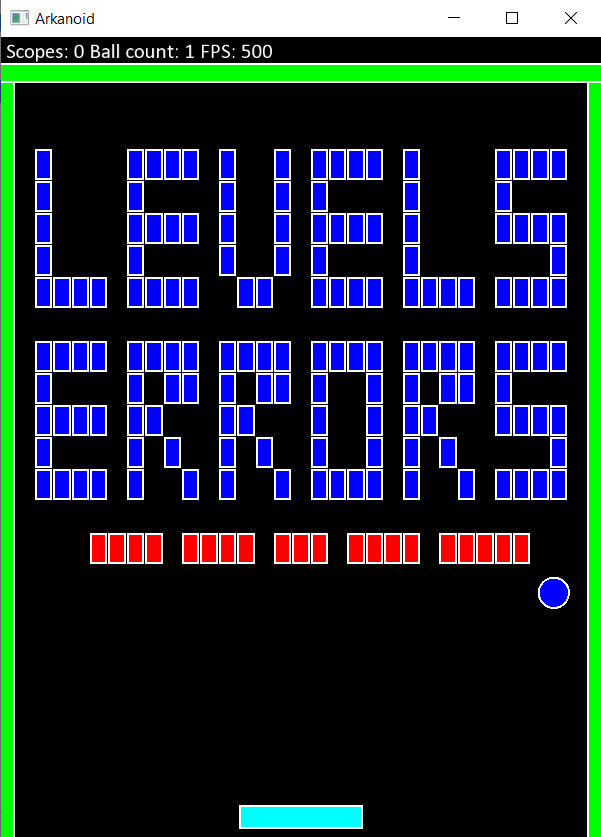

# Arkanoid

## Idea

The idea is to create a copy of the original arkanoid game from ZX Spectrum:

Latest version available [here](https://github.com/marleeeeeey/PublicStore/tree/master/releases).

## Levels

Not all of the levels is implemented now. The levels order is random.

## Level editor

To edit levels change file `config/levels.txt`. 

`0` - immortal brick
`1..9` - usual brick with lives
`R` RenewableBalls
`M` MultiBalls
`A` AddPlateLive (coming soon)
`L` LongPlate
`G` MagnetPaddle
`D` DisableBonuses
`W` AroundWall (coming soon)
`N` NextLevel (coming soon)
`S` DecreaseBallSpeed
`F` FireBall

In case of errors in level editor you will see special level in runtime:

## Prerequisites

1. cmake
2. gtest
3. gmock
4. sfml
5. nsis (windows)

