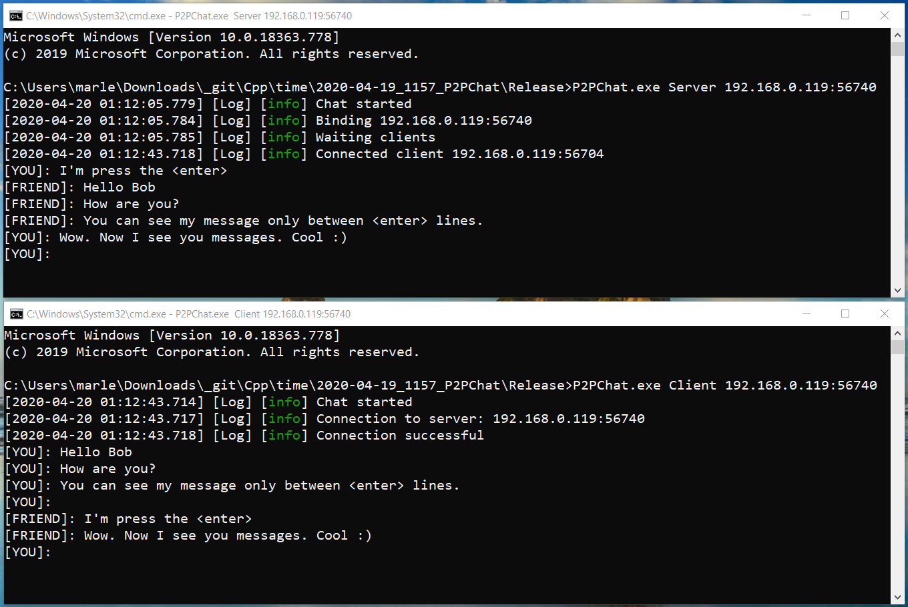

# P2PChat

## Idea

The idea is create extensible chat with supporting 

1. Several protocols for communication: TCP, WinNamedPipe.
2. Different UI to work with user input/output: Console, Qt Based, MFC/ATL, WPF(C#).
3. Chose protocols and UI in Runtime as DLL or even Win COM library as plugins.
4. Make platform independent parts buildable on different system: Windows, Linux. Probably by using CMAKE build system.
5. It should be easy to extend functionality with custom plugins.
6. Add unit and integration tests.

To do that I practice my knowledge of SOLID, OOP Patterns, Architecture design, Testing, STL and OS API.

## History

2020-04-19 `P2PChat v1.0`: TCP Sockets for communication and console as UI.

## Appearance

###  Console view

## How to use it

1. Build `P2PChat.sln`
2. Start server: `P2PChat.exe Server 192.168.0.119:56740`
3. Start client: `P2PChat.exe Client 192.168.0.119:56740`

## Code design

## Prerequisites

1. visual studio 2019

## 3rdParty

1. spdlog (C++ Header only library)
2. SocketWrapperLib (Socket OOP library based on examples from book Glazer - Multiplayer Game Programming)