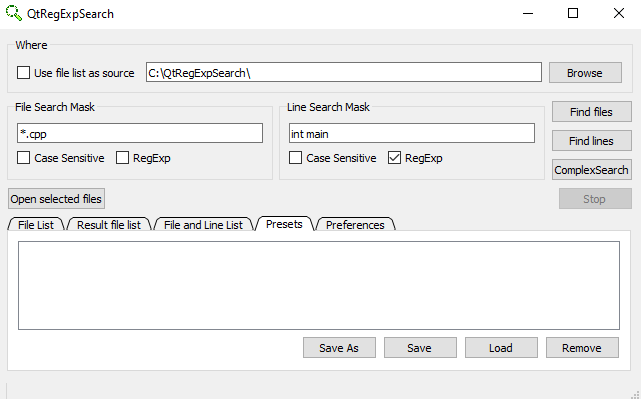

# QtRegExpSearch

Application to search lines in files. File-mask and line-mask can be configurable via UI and saved in the platform dependent data base (for windows it is registry, for Linux - text files with configuration).

There is example how the application looks like on the first run.

